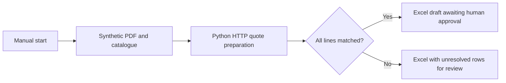

# Local n8n integration

This workflow sends the bundled synthetic RFQ PDF and catalogue to the Python
HTTP adapter, routes matching drafts separately from unresolved rows, and exposes
the actual Python-generated workbook in n8n's binary output. It does not recalculate
prices in JavaScript or convert displayed JSON values back into a new spreadsheet.

The two outputs are review destinations only. Neither is a recorded human approval,
an outgoing email, an ERP update, or permission to collect payment.

## Observed results — September 13, 2026

All seven cases passed using n8n **2.38.7**, Node.js **24.18.0**, Python **3.12.14**,
and a real loopback HTTP connection. See [validation.json](validation.json).

| Input | Observed result |
| --- | --- |
| Six-line PDF fixture | Review branch; four flags; partial USD 32.50; complete total absent |
| Matched USD and EUR lines | Draft branch; USD 3.09 and EUR 7.50 kept separate |
| Zero-price product | Draft branch; USD 0.00 retained; code `0001` preserved |
| Repeated RFQ lines | Review branch; both lines retained and unpriced |
| Unknown product | Review branch; unknown row retained and unpriced |
| Invalid catalogue headers | HTTP 422; workflow stops before either file output |
| XLSX amount exceeds precision limit | HTTP 422; workflow stops before either file output |

All five successful executions produced workbooks identical to the API's bytes.
The independent openpyxl reader checked both worksheet names and literal cells;
the mixed-currency case also checked leading zeros and Chinese descriptions.
The verifier uses in-memory binary storage for these small n8n 2.x tests. This does
not establish filesystem/S3/database binary storage or compatibility with n8n 3.x.



## Import and run

Use **n8n 2.38.7 with Node.js 24** running natively on the same computer as Python. The loopback URL
does not point to your computer from n8n Cloud or an ordinary Docker container.
Client deployment and arbitrary PDF layouts require separate validation.

1. Install the root `requirements.txt`, then start `local_api.py` as described in
   [HTTP-INTEGRATION.md](../HTTP-INTEGRATION.md). Keep its random local token private.
2. Import `rfq-review-workflow.json` into n8n as a new workflow.
3. Create/select a **Header Auth** credential named `RFQ local API`: header name
   `Authorization`, value `Bearer ` followed by your local token. Select it in
   **Prepare draft**. The workflow export contains no token.
4. Check that **Prepare draft** points to the actual local API port. By default it
   is `http://127.0.0.1:8765/quote`. Keep **Never Error** and **Retry On Fail** off.
5. Execute the workflow manually. The sample has six rows and four review flags,
   so only **Unresolved lines - review required** should produce an item. Its
   `workbook` binary field is a downloadable `quote-draft.xlsx`.
6. Inspect the JSON from **Prepare draft** for flags, source digests and separate
   currency subtotals. The sample's USD 32.50 is a matched-lines subtotal, not a
   complete quote total. Both output paths require human review outside this demo.

The input is embedded synthetic fixture data in **Synthetic RFQ input**, not an
inbox watcher or generic PDF parser. For another supported local sample, generate
request JSON using `make_request.py --xlsx` and replace that node's JSON value.
Do not put real customer files into a public workflow export.

## Repeat the integration checks

Install a local n8n runtime in a separate directory (no global install needed):

```sh
npm install --no-audit --no-fund --save-exact n8n@2.38.7
```

From this repository, install `requirements-test.txt`, then run:

```sh
python n8n/verify_integration.py --n8n-bin /path/to/node_modules/n8n/bin/n8n --out /path/to/local-results
```

Add `--node /path/to/node` if Node.js is not on PATH. The verifier starts a temporary
loopback RFQ server, creates its own temporary n8n instance, imports a newly generated
local test credential, imports workflows, and invokes the actual `n8n execute --id`
command. It does not use your existing n8n accounts, workflows, or credentials.
Both the server and the temporary instance are cleaned up when the check finishes.

Assertions inspect n8n's execution data and the downloaded workbook bytes, rather
than trusting the CLI exit code alone. Local raw execution logs include the synthetic
inputs and generated output; only the curated validation summary belongs in a public
release. No native Microsoft Excel application or customer environment is covered.

## Sources

- [n8n npm installation](https://docs.n8n.io/deploy/host-n8n/install-options/install-with-npm)
- [n8n server CLI](https://docs.n8n.io/deploy/host-n8n/configure-n8n/use-the-command-line)
- [HTTP Request node](https://docs.n8n.io/integrations/builtin/core-nodes/n8n-nodes-base.httprequest)
- [Convert to File node](https://docs.n8n.io/integrations/builtin/core-nodes/n8n-nodes-base.converttofile)
